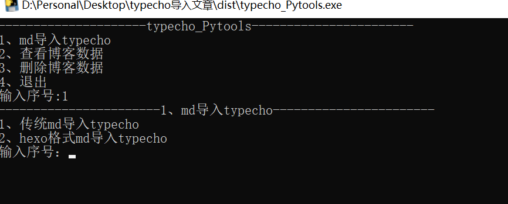

# typecho_Pytools

typecho_Pytools工具由python编写，可以快速批量的在本地发布文章，不需要登陆后台粘贴md文件内容，同时此工具还能查看最新的评论消息。...

## 一、主要功能

- 所有操作不用登陆博客网页后台

- 快速发布hexo格式的markdown文件
- 快速发布传统makkdown文件
- 查看博客数据(博客、最新评论)
- 管理博客

## 二、运行方法

**方法1：**直接运行打包好的exe程序(简单)

直接下载打包号的exe文件运行。

>  建议在cmd中运行程序


**方法2：**python环境运行

安装依赖

```python
pip install pytypecho
```

克隆代码到本地

```git
git clone https://github.com/tanglx02/typecho_Pytools.git
```

直接运行

```
python typecho_Pytools.py
```


## 三、使用方法

首次运行程序会在程序目录下创建如下文件和目录

```
目录
md			#存放传统markdown的文件夹
hexo_md		#存放hexo格式的文件夹
md_ok		#上传完博客后会把对应md文件存放到这个目录,防止博客文档重复
文件
config.json	#配置文件,存放url\账号\密码
```

**1、修改配置文件**

首次运行程序自动创建config.json

把config.json内的配置修改为自己的博客

```json
{
"url":"http://domain.com",
"username":"admin",
"password":"123456"
}
```

**2、把要上传的md文件存放到对应目录**

首次运行程序自动创建md、hexo_md、md_ok这几个目录

```
md			#存放传统markdown的文件夹
hexo_md		#存放hexo格式的文件夹
md_ok		#上传到博客后会把(md&hexo_md)对应的md文件存放到这个目录,防止博客文档重复
```


**3、运行程序**

做完第一步和第二步后直接运行程序,根据程序内提示来选择即可

细节点:

> 传统md类的markdown选择1,  hexo格式类的markdown选择2
>
> a.传统格式markdown在上传时,根据程序引导输入博客标题,分类等内容完成上传!
>
> b.hexo格式类的markdown在上传时,程序内不需要输入博客标题等内容,程序会读取md文件内的信息作为参数


